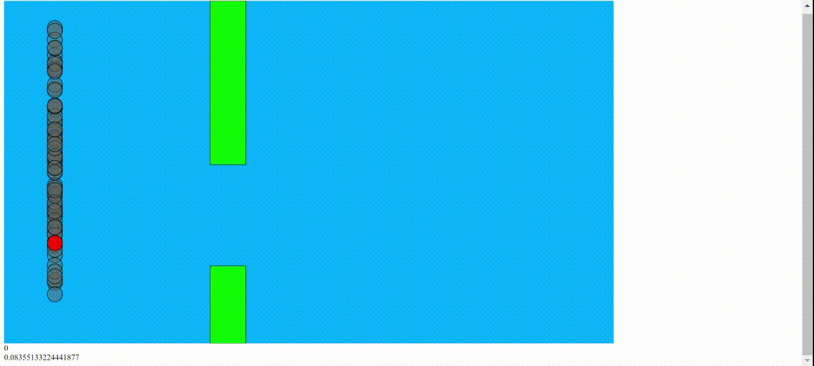

#Reinforcement Learning with Flappy Bird
- This program uses a neural network architecture to produce the "Q" values in reinforcement learning
- The agent learns from live experience to play the game Flappy Bird
- Example Run:
```
live_learning/index.html
```

